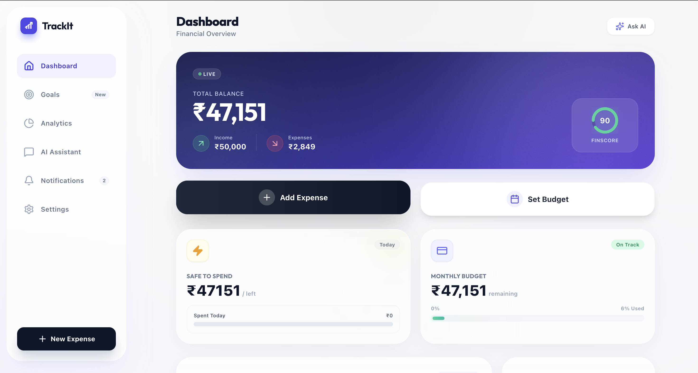

TrackIt – AI Powered Personal Finance App

TrackIt is an AI-driven money assistant that helps students and Gen Z automatically track expenses, predict future spending, avoid overspending, and build better financial habits through gamification.

Built using Google AI Studio + TypeScript + Vite.

🚀 Features

AI Auto Expense Detection (reads SMS patterns)

Predictive Spending Forecast

Smart Overspending Alerts

Gamification (XP, Streaks, Levels)

AI Money Coach

Savings Roadmap

Financial Health Score

Analytics Dashboard

📦 Tech Stack

Frontend: TypeScript, Vite, React-like UI from AI Studio

AI: Google Gemini API

Build Tool: Vite

Deployment: Local / Any static host

🛠️ Run Locally
Prerequisites

Node.js 18+

Your Gemini API Key

Steps
# 1. Install dependencies
npm install

# 2. Create env file
cp .env.local.example .env.local

# 3. Add your Gemini API key
GEMINI_API_KEY="your_api_key_here"

# 4. Start development server
npm run dev

🚀 Build for Production
npm run build

📁 Project Structure
/components     → UI components (Dashboard, Analytics, Coach, etc.)
/services       → API services (Gemini, helpers)
/public         → Static assets
App.tsx         → Main app entry
types.ts        → Shared types
vite.config.ts  → Vite configuration

💡 About TrackIt

Created for MumbaiHacks 2025 — an AI-powered financial wellness app designed to turn spending into saving through intelligence + gamification.